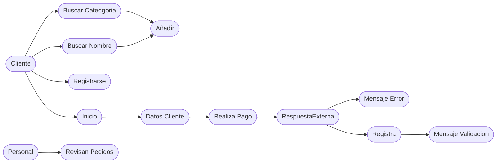

```mermaid
flowchart LR

actorCliente([Cliente])
actorValidacionExterna([RespuestaExterna])
actorPersonal([Personal])

casoUsoNombre([Buscar Nombre])
casoUsoCategoria([Buscar Cateogoria])
casoUsoAñadir([Añadir])
casoUsoRegistro([Registrarse])
casoUsoInicio([Inicio])
casoUsoIntroduceDatos([Datos Cliente])
casoRealizaPago([Realiza Pago])
casoError([Mensaje Error])
casoCorrectoRegistra([Registra])
casoCorrectoValidacion([Mensaje Validacion])
casoRevisanPedidos([Revisan Pedidos])

actorCliente -->  casoUsoNombre
actorCliente --> casoUsoCategoria
casoUsoCategoria -->  casoUsoAñadir
casoUsoNombre --> casoUsoAñadir
actorCliente --> casoUsoRegistro
actorCliente --> casoUsoInicio
casoUsoInicio --> casoUsoIntroduceDatos
casoUsoIntroduceDatos --> casoRealizaPago
casoRealizaPago --> actorValidacionExterna
actorValidacionExterna --> casoError
actorValidacionExterna -->  casoCorrectoRegistra
casoCorrectoRegistra -->  casoCorrectoValidacion

actorPersonal --> casoRevisanPedidos
``` 