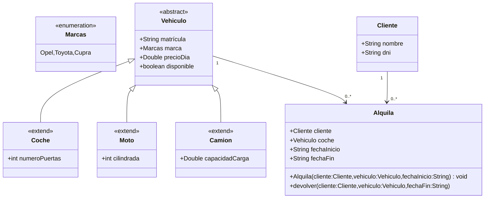

```mermaid
classDiagram
    class Marcas {
        <<enumeration>>
        Opel,Toyota,Cupra
    }
    
    class Vehiculo {
        <<abstract>>
       +String matrícula
       +Marcas marca
       +Double precioDia
       +boolean disponible
       }
    
    class Coche{ 
        <<extend>>
        +int numeroPuertas
    }
    
    class Moto{
        <<extend>>
     +int cilindrada   
    }

    class Camion{
        <<extend>>
    +Double capacidadCarga
    }
    
   Vehiculo <|-- Coche
    Vehiculo <|-- Moto
    Vehiculo <|-- Camion

    class Cliente {
        +String nombre
        +String dni
    }
    
    class Alquila{
        +Cliente cliente
        +Vehiculo coche
        +String fechaInicio
        +String fechaFin
        +Alquila(cliente:Cliente,vehiculo:Vehiculo,fechaInicio:String) void
        +devolver(cliente:Cliente,vehiculo:Vehiculo,fechaFin:String)
    }
    
    Vehiculo "1" --> "0..*" Alquila
    Cliente "1" --> "0..*" Alquila


```