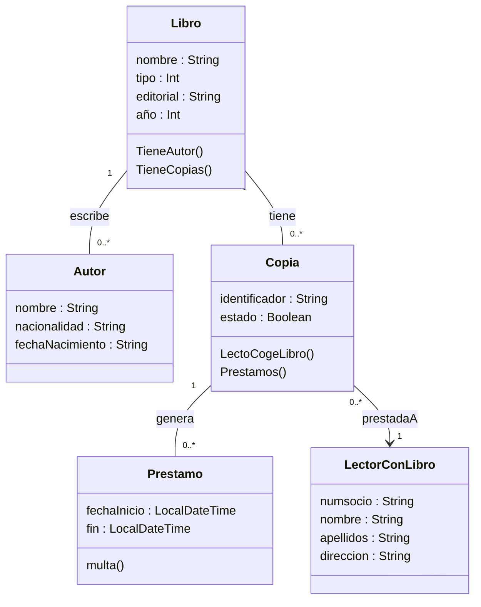

```mermaid
classDiagram
    direction TB

    class Libro {
        nombre : String
        tipo : Int
        editorial : String
        año : Int
        TieneAutor()
        TieneCopias()
    }

    class Autor {
        nombre : String
        nacionalidad : String
        fechaNacimiento : String
    }

    class LectorConLibro {
        numsocio : String
        nombre : String
        apellidos : String
        direccion : String
    }

    class Copia {
        identificador : String
        estado : Boolean
        LectoCogeLibro()
        Prestamos()
    }

    class Prestamo {
        fechaInicio : LocalDateTime
        fin : LocalDateTime
        multa()
    }

Libro "1" -- "0..*" Copia : tiene
Libro "1" -- "0..*" Autor : escribe
Copia "1" -- "0..*" Prestamo : genera
Copia "0..*" --> "1" LectorConLibro : prestadaA

```
