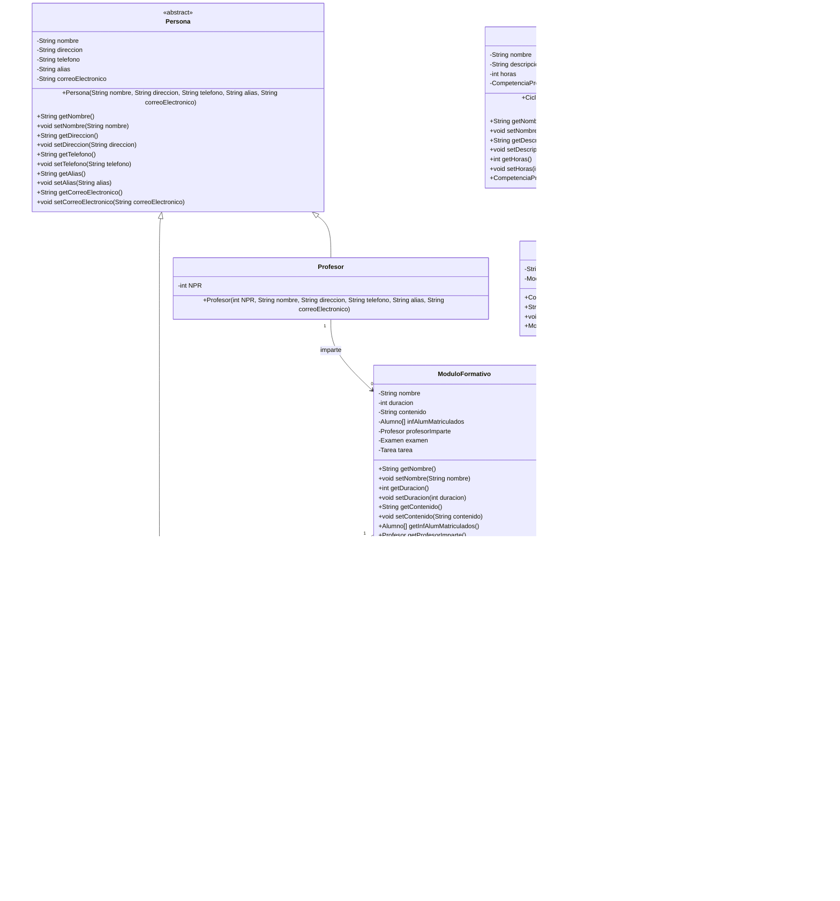

```mermaid
classDiagram
    direction TB

    class Persona {
        <<abstract>>
        -String nombre
        -String direccion
        -String telefono
        -String alias
        -String correoElectronico
        +Persona(String nombre, String direccion, String telefono, String alias, String correoElectronico)
        +String getNombre()
        +void setNombre(String nombre)
        +String getDireccion()
        +void setDireccion(String direccion)
        +String getTelefono()
        +void setTelefono(String telefono)
        +String getAlias()
        +void setAlias(String alias)
        +String getCorreoElectronico()
        +void setCorreoElectronico(String correoElectronico)
    }

    class Alumno {
        -float notaMedia
        +Alumno(float notaMedia, String nombre, String direccion, String telefono, String alias, String correoElectronico)
        +float getNotaMedia()
        +void setNotaMedia(float notaMedia)
    }

    class Profesor {
        -int NPR
        +Profesor(int NPR, String nombre, String direccion, String telefono, String alias, String correoElectronico)
    }


    class CicloFormativo {
        -String nombre
        -String descripcion
        -int horas
        -CompetenciaProfesional[] infCompeProfesionales
        +CicloFormativo(String nombre, String descripcion, int horas, CompetenciaProfesional[] infCompeProfesionales)
        +String getNombre()
        +void setNombre(String nombre)
        +String getDescripcion()
        +void setDescripcion(String descripcion)
        +int getHoras()
        +void setHoras(int horas)
        +CompetenciaProfesional[] getInfCompeProfesionales()
    }

    class CompetenciaProfesional {
        -String descripcion
        -ModuloFormativo[] infModuFormat
        +CompetenciaProfesional(String descripcion, ModuloFormativo[] infModuFormat)
        +String getDescripcion()
        +void setDescripcion(String descripcion)
        +ModuloFormativo[] getInfModuFormat()
    }

    class ModuloFormativo {
        -String nombre
        -int duracion
        -String contenido
        -Alumno[] infAlumMatriculados
        -Profesor profesorImparte
        -Examen examen
        -Tarea tarea
        +String getNombre()
        +void setNombre(String nombre)
        +int getDuracion()
        +void setDuracion(int duracion)
        +String getContenido()
        +void setContenido(String contenido)
        +Alumno[] getInfAlumMatriculados()
        +Profesor getProfesorImparte()
        +void setProfesorImparte(Profesor profesorImparte)
        +Examen getExamen()
        +void setExamen(Examen examen)
        +Tarea getTarea()
        +void setTarea(Tarea tarea)
    }

    class Examen {
        -Pregunta[] preguntas
        +Pregunta[] getPreguntas()
    }

    class Pregunta {
        -String enunciado
        -String[] respuestas
        -int respuestaValida
        -Examen[] examenesDondeSeUsa
        +Pregunta(String enunciado, String[] respuestas, int respuestaValida, Examen[] examenesDondeSeUsa)
        +String getEnunciado()
        +void setEnunciado(String enunciado)
        +String[] getRespuestas()
        +int getRespuestaValida()
        +void setRespuestaValida(int respuestaValida)
        +Examen[] getExamenesDondeSeUsa()
    }

    class Tarea {
        -String descripcion
        +Tarea(String descripcion)
        +String getDescripcion()
        +void setDescripcion(String descripcion)
    }

    Persona <|-- Alumno
    Persona <|-- Profesor
CicloFormativo "1" -- "0..*" CompetenciaProfesional : contiene
CompetenciaProfesional "1" -- "0..*" ModuloFormativo : incluye

ModuloFormativo "1" --> "0..*" Alumno : matricula
Profesor "1" --> "0..*" ModuloFormativo : imparte

ModuloFormativo "1" -- "0..1" Examen : tiene
ModuloFormativo "1" -- "0..1" Tarea : tiene

Examen "1" -- "0.30" Pregunta : contiene
Pregunta "0..*" --> "0..*" Examen : seUsaEn
```