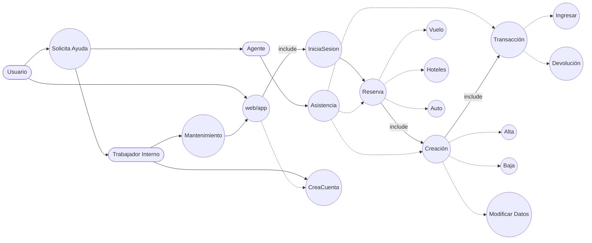

```mermaid
flowchart LR
    actorUsuario([Usuario])
    actorAgente([Agente])
    actorTrabajador([Trabajador Interno])
    casoAyuda((Solicita Ayuda))
    casoReserva((Reserva))
    casoAPP((web/app))
    casoMantenimiento((Mantenimiento))
    casoCreacion((Creación))
    casoAsistencia((Asistencia))
    casoTransacción((Transacción))
    casoVuelo((Vuelo))
    casoHoteles((Hoteles))
    casoIniciaSesion((IniciaSesion))
    casoCreaCuenta((CreaCuenta))
    casoAuto((Auto))
    casoAlta((Alta))
    casoBaja((Baja))
    casoDatos((Modificar Datos))
    casoIngresar((Ingresar))
    casoDevolución((Devolución))
    
     actorUsuario --> casoAPP
    casoIniciaSesion --> casoReserva
    actorUsuario --> casoAyuda
    casoAyuda --> actorAgente
    casoReserva -.-> casoVuelo
    casoReserva -.-> casoHoteles
    casoReserva -.-> casoAuto
    casoReserva --> |include| casoCreacion
    casoCreacion -.-> casoAlta
    casoCreacion -.-> casoBaja
    casoCreacion -.-> casoDatos
    actorAgente --> casoAsistencia    

    actorTrabajador --> casoCreaCuenta
    casoAyuda -->  actorTrabajador
    actorTrabajador --> casoMantenimiento
    casoMantenimiento --> casoAPP
    casoAPP --> |include| casoIniciaSesion
    casoAPP -.-> casoCreaCuenta
    casoAsistencia -.-> casoReserva
    casoAsistencia -.-> casoCreacion
    casoAsistencia -.-> casoTransacción
     casoCreacion --> |include| casoTransacción
     casoTransacción -.-> casoIngresar
     casoTransacción -.-> casoDevolución

``` 