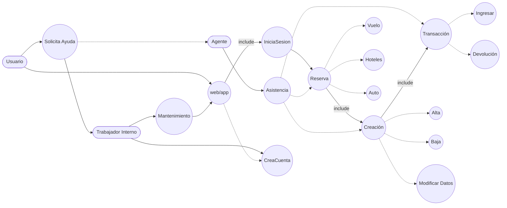

# EJERCICIO 4

## Identificación de Actores

| Actor | Descripción |
|-------|------------|
| **Usuario** | Persona que utiliza la plataforma para buscar y reservar vuelos, hoteles y autos. También puede gestionar su cuenta y solicitar ayuda. |
| **Agente de Viajes** | Empleado que ayuda a los usuarios con reservas, asistencia y transacciones. |
| **Trabajador Interno** | Personal del sistema que realiza asistencia, gestión de cuentas y tareas de mantenimiento del sistema. |

---

## Identificación de Casos de Uso y Descripción

| Caso de Uso | Descripción |
|------------|------------|
| **web/app (APP)** | Plataforma a través de la cual los usuarios interactúan con el sistema. |
| **Inicia Sesión** | Permite al usuario iniciar sesión en su cuenta para acceder a las funcionalidades. |
| **Crea Cuenta** | Permite al usuario registrarse en la plataforma. |
| **Reserva** | Permite al usuario realizar reservas de vuelos, hoteles o autos. |
| **Vuelo** | Reserva de vuelos (opcional, extendido desde Reserva). |
| **Hoteles** | Reserva de hoteles (opcional, extendido desde Reserva). |
| **Auto** | Reserva de autos (opcional, extendido desde Reserva). |
| **Creación** | Creación de reservas o registros relacionados (include obligatorio en Reserva). |
| **Alta** | Crear nuevos registros dentro del sistema (opcional, extendido desde Creación). |
| **Baja** | Eliminar registros dentro del sistema (opcional, extendido desde Creación). |
| **Modificar Datos** | Modificar información de la cuenta o reservas (opcional, extendido desde Creación). |
| **Transacción** | Gestión de pagos, ingresos y devoluciones de reservas (include desde Creación). |
| **Ingresar** | Registrar pagos o transacciones (opcional, extendido desde Transacción). |
| **Devolución** | Procesar devoluciones de pagos o reservas (opcional, extendido desde Transacción). |
| **Solicita Ayuda** | Caso de uso en el que el usuario solicita asistencia dentro del sistema. |
| **Asistencia** | Los agentes prestan ayuda sobre reservas, creaciones y transacciones. |
| **Asiste** | Los trabajadores internos realizan asistencia, mantenimiento o creación de cuentas. |
| **Mantenimiento** | Gestión y mantenimiento del sistema, administrado por trabajadores internos. |

## Diagrama de Casos de Uso (Mermaid)

