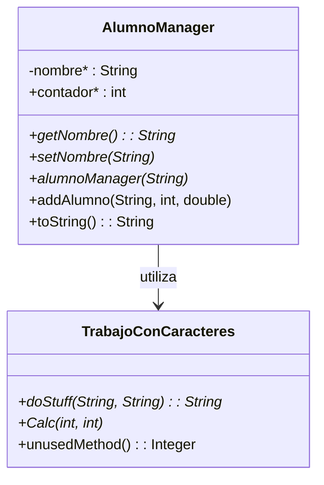

```mermaid
classDiagram
    direction TB

    class AlumnoManager {
        -nombre* : String
        +contador* : int
        +getNombre()* : String
        +setNombre(String)*
        +alumnoManager(String)*
        +addAlumno(String, int, double)
        +toString() : String
    }

    class TrabajoConCaracteres {
        +doStuff(String, String)* : String
        +Calc(int, int)*
        +unusedMethod() : Integer
    }

    AlumnoManager --> TrabajoConCaracteres : utiliza
```
