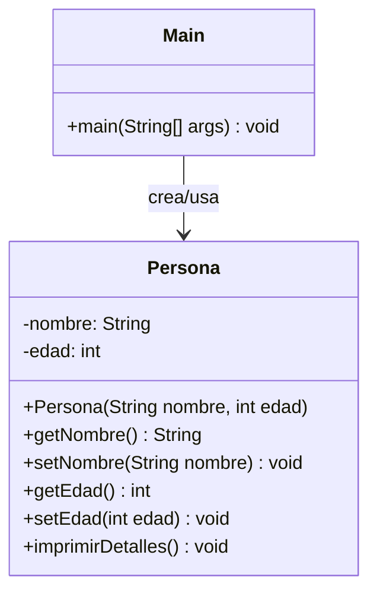

# Diagrama de Clases - Main y Persona

```mermaid
classDiagram
    class Main {
        +main(String[] args) void
    }
    
    class Persona {
        -nombre: String
        -edad: int
        +Persona(String nombre, int edad)
        +getNombre() String
        +setNombre(String nombre) void
        +getEdad() int
        +setEdad(int edad) void
        +imprimirDetalles() void
    }
    
    Main --> Persona : crea/usa
```

