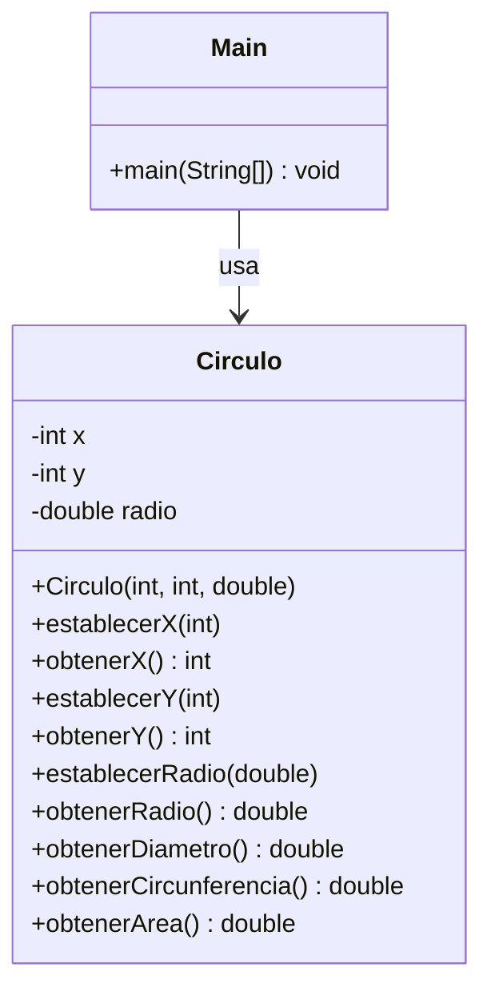

# Diagrama de Clases - Círculo

## Descripción
Diagrama que muestra la estructura de la clase `Circulo` y su relación con la clase `Main`.

```mermaid
classDiagram
    class Circulo {
        -int x
        -int y
        -double radio
        +Circulo(int, int, double)
        +establecerX(int)
        +obtenerX() int
        +establecerY(int)
        +obtenerY() int
        +establecerRadio(double)
        +obtenerRadio() double
        +obtenerDiametro() double
        +obtenerCircunferencia() double
        +obtenerArea() double
    }
    
    class Main {
        +main(String[]) void
    }
    
    Main --> Circulo : usa
```
