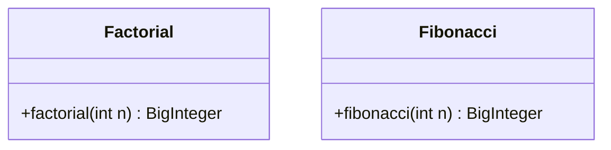

# Diagrama de Clases - Factorial y Fibonacci

```mermaid
classDiagram
    class Factorial {
       +factorial(int n) BigInteger
    }

    class Fibonacci {
      +fibonacci(int n) BigInteger
    }

```
