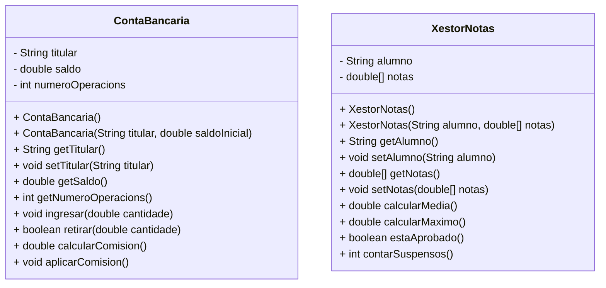

# Diagrama de Clases - ContaBancaria y XestorNotas

```mermaid
classDiagram
    class ContaBancaria {
       - String titular
       - double saldo
       - int numeroOperacions
       + ContaBancaria()
       + ContaBancaria(String titular, double saldoInicial)
       +  String getTitular()
       +  void setTitular(String titular)
       +  double getSaldo()
       +  int getNumeroOperacions()
       +  void ingresar(double cantidade)
       +  boolean retirar(double cantidade)
       +  double calcularComision()
       +  void aplicarComision()
    }

    class XestorNotas {
     - String alumno
     - double[] notas
     + XestorNotas()
     + XestorNotas(String alumno, double[] notas)
     + String getAlumno()
     + void setAlumno(String alumno)
     + double[] getNotas()
     + void setNotas(double[] notas)
     + double calcularMedia()
     + double calcularMaximo()
     + boolean estaAprobado()
     + int contarSuspensos()
    }

```
