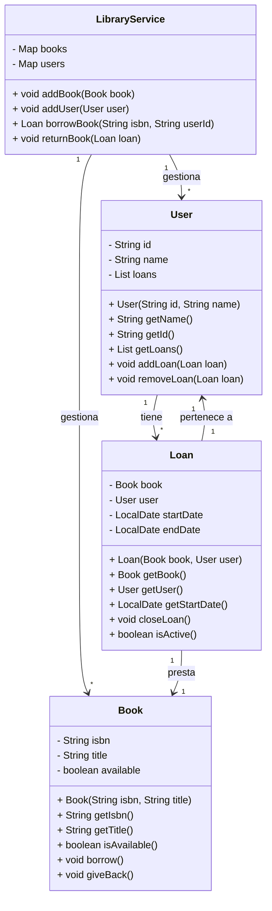

# Diagrama de Clases

## Descripción de las clases

- `Book`: representa un libro con ISBN, título y disponibilidad.
- `User`: representa un usuario con identificador, nombre y lista de préstamos.
- `Loan`: representa un préstamo entre un libro y un usuario, con fecha de inicio y estado activo.
- `LibraryService`: gestiona el catálogo de libros, usuarios y operaciones de préstamo y devolución.
