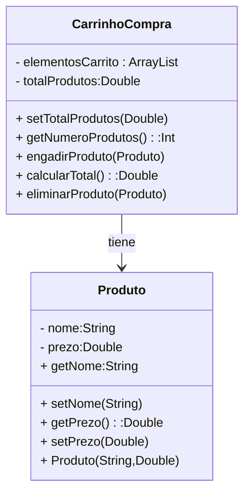

```mermaid
classDiagram
    direction TB

    class CarrinhoCompra {
       - elementosCarrito : ArrayList<Produto>
       - totalProdutos:Double
       + setTotalProdutos(Double)
       + getNumeroProdutos():Int
       + engadirProduto(Produto)
       + calcularTotal():Double
       + eliminarProduto(Produto)

    }

    class Produto {
      - nome:String
      - prezo:Double
      + getNome:String
      + setNome(String)
      + getPrezo():Double
      + setPrezo(Double)
      + Produto(String,Double)
    }

    CarrinhoCompra --> Produto : tiene
```
