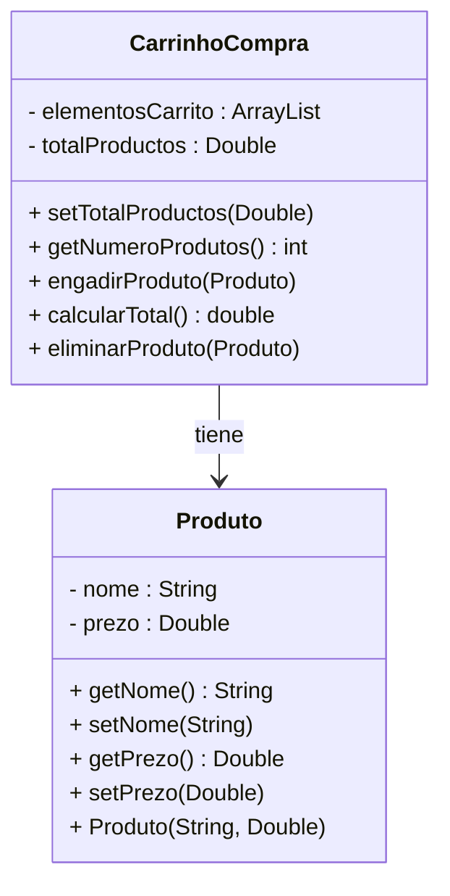

# Diagrama de Clases - CarrinhoCompra y Produto

```mermaid
classDiagram
    direction TB

    class CarrinhoCompra {
       - elementosCarrito : ArrayList<Produto>
       - totalProductos : Double
       + setTotalProductos(Double)
       + getNumeroProdutos() int
       + engadirProduto(Produto)
       + calcularTotal() double
       + eliminarProduto(Produto)
    }

    class Produto {
      - nome : String
      - prezo : Double
      + getNome() String
      + setNome(String)
      + getPrezo() Double
      + setPrezo(Double)
      + Produto(String, Double)
    }

    CarrinhoCompra --> Produto : tiene
```
